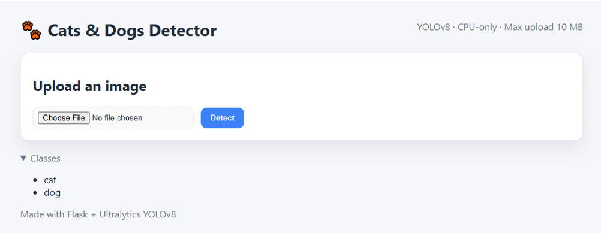
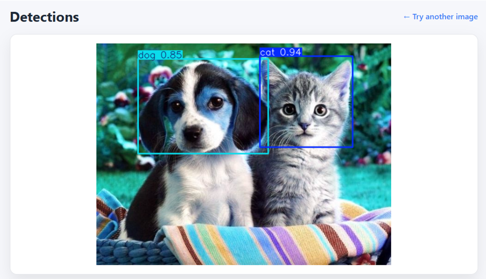

# 🐾 Object Detection Flask App

This project is a **Flask web application** that uses **YOLOv8** (Ultralytics) to detect **cats and dogs** in uploaded images.  
It includes a simple web UI and a JSON API, and is fully containerized with Docker for easy deployment.

---

## 🚀 Features
- Upload an image through the web interface
- Run YOLOv8 inference on CPU (no GPU required)
- See annotated results with bounding boxes and confidence scores
- Download detections as JSON via `/api/predict`
- Ready-to-deploy Dockerfile (uses Gunicorn in production)
- Health check endpoint at `/health`

---

## 🛠️ Tech Stack
- Python 3.10
- Flask 3
- YOLOv8 (Ultralytics)
- OpenCV + Pillow
- Docker + Gunicorn

---

## 📦 Project Structure
````
```text
````
object-detection-flask/
├─ app.py                # Main Flask app
├─ Dockerfile            # Deployment config
├─ requirements.txt      # Python dependencies
├─ .gitignore            # Git ignore rules
├─ models/
│  ├─ catdog_yolov8n.pt  # YOLOv8 model weights
│  └─ classes.txt        # Class labels (cat, dog)
├─ static/
│  └─ style.css          # Styling for frontend
├─ templates/
│  ├─ index.html         # Upload page
│  └─ result.html        # Results page
└─ README.md             # Project description
````
````
````
---

## ▶️ Run Locally (Docker)

1. **Build the Docker image**  
   docker build -t object-detection-flask .

2. **Run the Container**  
   docker run -p 7860:7860 -e PORT=7860 object-detection-flask

3. **Open in browser:**
  - UI → http://localhost:7860
  - Health check → http://localhost:7860/health


## 🌐 Deploy on Render

This repo is ready to deploy on [Render](https://render.com):

1. Push this project to GitHub.
2. Create a new **Web Service** on Render.
3. Connect your GitHub repo.
4. Render auto-detects the `Dockerfile`.
5. Set health check path: `/health`.
6. Deploy 🚀


## 📸 Screenshots

### Home Page


### Detection Result


## 📄 License
MIT License © 2025